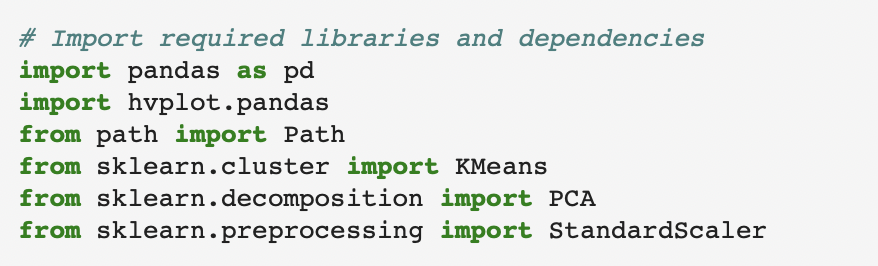

# Crypto Clustering
Jupyter Notebook that clusters cryptocurrencies by their performance in different time periods.  Results will be plotted to visually represent the performance.

# Technologies

# Instructions
Use the starter code file to complete the tasks outlined in the Instructions. The steps for this Challenge are divided into the following sections:
Import the Data (provided in the starter code)
Prepare the Data (provided in the starter code)
Find the Best Value for k Using the Original Data
Cluster Cryptocurrencies with K-means Using the Original Data
Optimize Clusters with Principal Component Analysis
Find the Best Value for k Using the PCA Data
Cluster the Cryptocurrencies with K-means Using the PCA Data
Visualize and Compare the Results

